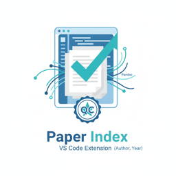

<p align="center">
  
</p>

# Paper Index VS Code Extension

A VS Code extension that validates Pandoc citations in Markdown files against indexed academic sources using [paper-index-tool](https://github.com/dennisvriend/paper-index-tool) and AWS Bedrock Claude.

## Features

- Parses Pandoc citations: `[@author2023]`, `[@author2023, p. 42]`, `@author2023`
- LLM-based validation with three-tier status: Supported, Partial, Not Supported
- VS Code integration: diagnostics, decorations, CodeLens, hover info, quick fixes

## Requirements

- [paper-index-tool](https://github.com/dennisvriend/paper-index-tool) CLI
- AWS credentials with Bedrock access
- VS Code 1.85.0+

## Installation

```bash
npm install
npm run build
```

Install the generated `.vsix` file or press F5 in VS Code for development mode.

## Usage

1. Open a Markdown file with Pandoc citations
2. Run `Paper Index: Validate Citations` command
3. View results via decorations (green/yellow/red) and Problems panel

## Commands

| Command | Description |
|---------|-------------|
| `Paper Index: Validate Citations` | Validate all citations |
| `Paper Index: Validate Current Citation` | Validate citation at cursor |
| `Paper Index: Clear Cache` | Clear validation cache |

## Configuration

| Setting | Default | Description |
|---------|---------|-------------|
| `paperIndex.cliPath` | `paper-index-tool` | CLI path |
| `paperIndex.bedrock.region` | `us-east-1` | AWS region |
| `paperIndex.bedrock.model` | `anthropic.claude-sonnet-4-20250514-v1:0` | Model ID |
| `paperIndex.validateOnSave` | `false` | Auto-validate on save |

## License

MIT
